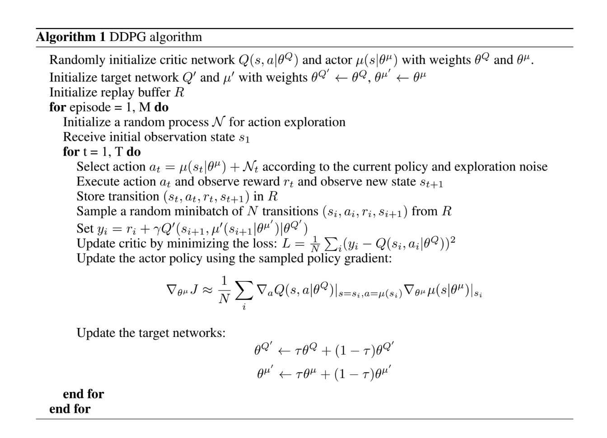

# Continuous Control Udacity Project Report

## Discussion of Methods Attempted
First I used a DDPG implementation to attempt to solve the environment. The choice of DDPG was motivated by a previous understanding of DQN as well as an example implementation provided in the course repo to build from.

I attempted to adapt the pendulum example provided to the single arm unity environment. I could not see any learning. I spent some time experimenting with hyper-parameters and checking the agent class for errors, but I could not find a set that worked.

Next I adapted the bi-pedal open AI example. I still could not get a single arm to learn. I checked the slack channel. I found some hyper-parameter and network architecture examples, but still could not get the single arm to work.

Then I implemented the 20 arm environment and quickly saw learning. The learning increase from 20 times more experiences is remarkable. Why does it seem much more effective than running one agent 20 times longer?

Possible Explanations:
* The single agent seems to act erratically and spends very little time in positive reward, while the many actors seem to have a greater chance of initializing in a preferential area.
* The many agents add 20 experiences to the replay each time step in this implementation. They also update based on batches of Replay memory 20 times for each step. This may smooth out and slow down the agents, but I'm skeptical
## Method used
### DDPG Algorithm:
[Lillicrap et al. 2016](http://arxiv.org/abs/1509.02971)

### Hyper-parameters

### Network Architecture

## Ideas for Future Work
The agents seem to be moving too fast during the beginning of the learning phase. Maybe it would be useful to slow down movement at first. This only seems applicable for environments that contain moving parts. Maybe there should be some overall initial exploration variance factor that takes into account both the potential change of the agent and the potential change of the environment to control the speed and acceleration of the actions.  

I should attempt to implement the other actor-critic methods described in the Udacity course.
* A3C: Asynchronous Advantage Actor-Critic, N-step Bootstrapping
* A2C: Advantage Actor-Critic
* GAE: Generalized Advantage Estimation [Schulman et al. 2015](http://arxiv.org/abs/1506.02438)
* PPO
*
I would like to implement the methods outlined in [Duan et al. 2016](http://arxiv.org/abs/1604.06778) and check their effectiveness

## Citations
Lillicrap, Timothy P., Jonathan J. Hunt, Alexander Pritzel, Nicolas Heess, Tom Erez, Yuval Tassa, David Silver, and Daan Wierstra. 2015. “Continuous Control with Deep Reinforcement Learning.” arXiv [cs.LG]. arXiv. http://arxiv.org/abs/1509.02971.

Duan, Yan, Xi Chen, Rein Houthooft, John Schulman, and Pieter Abbeel. 2016. “Benchmarking Deep Reinforcement Learning for Continuous Control.” arXiv [cs.LG]. arXiv. http://arxiv.org/abs/1604.06778.

Gu, Shixiang, Timothy Lillicrap, Zoubin Ghahramani, Richard E. Turner, and Sergey Levine. 2016. “Q-Prop: Sample-Efficient Policy Gradient with An Off-Policy Critic.” arXiv [cs.LG]. arXiv. http://arxiv.org/abs/1611.02247.

Mnih, Volodymyr, Koray Kavukcuoglu, David Silver, Andrei A. Rusu, Joel Veness, Marc G. Bellemare, Alex Graves, et al. 2015. “Human-Level Control through Deep Reinforcement Learning.” Nature 518 (7540): 529–33.

Riedmiller, Martin. 2005. “Neural Fitted Q Iteration - First Experiences with a Data Efficient Neural Reinforcement Learning Method.” Planning Perspectives: PP 317: 328.

Rupam Mahmood, A., Dmytro Korenkevych, Brent J. Komer, and James Bergstra. 2018. “Setting up a Reinforcement Learning Task with a Real-World Robot.” arXiv [cs.LG]. arXiv. http://arxiv.org/abs/1803.07067.

Schulman, John, Philipp Moritz, Sergey Levine, Michael Jordan, and Pieter Abbeel. 2015. “High-Dimensional Continuous Control Using Generalized Advantage Estimation.” arXiv [cs.LG]. arXiv. http://arxiv.org/abs/1506.02438.

Silver, David, Guy Lever, Nicolas Heess, Thomas Degris, Daan Wierstra, and Martin Riedmiller. 2014. “Deterministic Policy Gradient Algorithms.” In International Conference on Machine Learning, 387–95.

Sutton, Richard S., and Andrew G. Barto. 1998. Introduction to Reinforcement Learning. Vol. 135. MIT press Cambridge.

Thrun, Sebastian, and Anton Schwartz. 1993. “Issues in Using Function Approximation for Reinforcement Learning.” In Proceedings of the 1993 Connectionist Models Summer School Hillsdale, NJ. Lawrence Erlbaum. https://www.ri.cmu.edu/pub_files/pub1/thrun_sebastian_1993_1/thrun_sebastian_1993_1.pdf.
