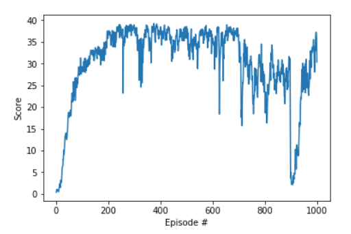
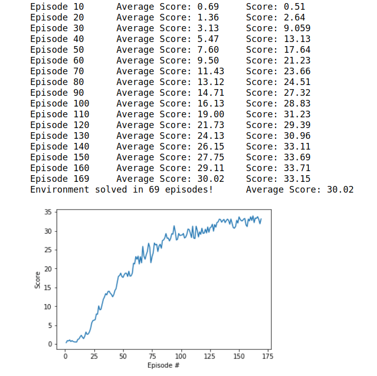

# Continuous Control Udacity Project Report

## Discussion of Methods Attempted
First I used a DDPG implementation to attempt to solve the environment. The choice of DDPG was motivated by a previous understanding of DQN as well as an example implementation provided in the [Udacity course Github](https://github.com/udacity/deep-reinforcement-learning) to build from.

I attempted to adapt the pendulum example provided to the single arm unity environment. I could not see any learning. I spent some time experimenting with hyper-parameters and checking the agent class for errors, but I could not find a set that worked.

Next I adapted the bi-pedal open AI example. I still could not get a single arm to learn. I checked the slack channel. I found some hyper-parameter and network architecture examples, but still could not get the single arm to work.

Then I implemented the 20 arm environment and quickly saw learning. The learning increase from 20 times more experiences is remarkable. Why does it seem much more effective than running one agent 20 times longer?

Possible Explanations:
* The single agent seems to act erratically and spends very little time in positive reward, while the many actors seem to have a greater chance of initializing in a preferential area.
* The many agents add 20 experiences to the replay each time step in this implementation. They also update based on batches of Replay memory 20 times for each step. This may smooth out and slow down the agents, but I'm skeptical

### Method Log:
I'm still having trouble getting 30, so I'm going to be a little more systemic in my approach
#### Attempt ~4
seed 33

ddpg_agent_con1.py

* BUFFER_SIZE = int(1e6)  # replay buffer size
* BATCH_SIZE = 128        # minibatch size
* GAMMA = 0.90            # discount factor
* TAU = 1e-3              # for soft update of target parameters
* LR_ACTOR = 1e-3         # learning rate of the actor
* LR_CRITIC = 1e-3        # learning rate of the critic
* WEIGHT_DECAY = 1e-6     # L2 weight decay

* replay_batch = 10       # number of replays to update with

Added an Epsilon to the noise to see if it helps.

I can see that the solutions from slack use a smaller network with batch normalization, but I think the given network should have enough flexibility to work. I'm going to adjust hyper-parameters on parallel notebooks to see if I can't find something that works well starting from a checkpoint.

model_con1.py (base network for the model)

#### Informal Parameter Tuning
I used a checkpoint where the agents were averaging 15 to guess-and-check the effects of hyper-parameter changes using the same network models over 20 episodes. I found the learning rate had a huge impact on performance and changes could make a divergent model if too high. The batch size seems to only have large effects in the extremes. I was surprised by the effect caused by L2 normalization. I would have thought a higher L2 would lead to more stability, but I found it had the opposite effect.

#### Kitchen Sink Approach Works!!
After much trial and error, I consulted the slack board and the Oracle (google) to find what worked for others. I found both [Zhang's](https://github.com/ShangtongZhang/DeepRL) and [Steidle's](https://github.com/tobiassteidle/DRLND_P2_Continuous-Control) implementations useful.

I added batch normalization, gradient clipping, annealed the noise with an epsilon, added a layer to the actor network, decreased the updates to once per time step, and increased the hidden layer sizes. Success!!!  
## Method used
### DDPG Algorithm:
[Lillicrap et al. 2016](http://arxiv.org/abs/1509.02971)


### Hyper-parameters
| Hyper-parameter | Value | Comment
| :------------- | :------------- | |
| BUFFER_SIZE | int(1e6)  | replay buffer size|
| BATCH_SIZE    | 128   | minibatch size    |
|GAMMA | 0.98  | discount factor|        
|TAU | 1e-3  | for soft update of target parameters   |         
|LR_ACTOR | 1e-4 |  learning rate of the actor |      
|LR_CRITIC | 1e-3 | learning rate of the critic |      
|WEIGHT_DECAY | 0  | L2 weight decay |  
|replay_batch | 1   | number of times per step to update (20 agents)|
|Epsilon | np.linspace(1,0.01,60000) | 60 episodes*1000steps|

### Network Architecture
#### Actor
```Python
print(agent.actor_local)

Actor(
  (bn0): BatchNorm1d(33, eps=1e-05, momentum=0.1, affine=True, track_running_stats=True)
  (fc1): Linear(in_features=33, out_features=400, bias=True)
  (bn1): BatchNorm1d(400, eps=1e-05, momentum=0.1, affine=True, track_running_stats=True)
  (fc2): Linear(in_features=400, out_features=300, bias=True)
  (bn2): BatchNorm1d(300, eps=1e-05, momentum=0.1, affine=True, track_running_stats=True)
  (fc3): Linear(in_features=300, out_features=4, bias=True)
)
```
#### Critic
```Python
print(agent.critic_local)

Critic(
  (fcs1): Linear(in_features=33, out_features=256, bias=True)
  (fc2): Linear(in_features=260, out_features=256, bias=True)
  (fc3): Linear(in_features=256, out_features=128, bias=True)
  (fc4): Linear(in_features=128, out_features=1, bias=True)
)
```
## Results
I first ran over 1000 episodes because I forgot to break the loop after solving. I solved version 2 with 20 agents. The Score is the average score of all 20 agents for each episode.
<br>The environment solved in 69 episodes!	Average Score: 30.02

As it kept learning it became divergent around 900 episodes, but recovered. 

I ran it again with a break after solving to get the initial solved weights.


## Ideas for Future Work
The agents seem to be moving too fast during the beginning of the learning phase. Maybe it would be useful to slow down movement at first. This only seems applicable for environments that contain moving parts. Maybe there should be some overall initial exploration variance factor that takes into account both the potential change of the agent and the potential change of the environment to control the speed and acceleration of the actions.  

I should attempt to implement the other actor-critic methods described in the Udacity course.
* A3C: Asynchronous Advantage Actor-Critic, N-step Bootstrapping
* A2C: Advantage Actor-Critic
* GAE: Generalized Advantage Estimation [Schulman et al. 2015](http://arxiv.org/abs/1506.02438)
* PPO
*
I would like to implement the methods outlined in [Duan et al. 2016](http://arxiv.org/abs/1604.06778) and check their effectiveness


## Citations
Lillicrap, Timothy P., Jonathan J. Hunt, Alexander Pritzel, Nicolas Heess, Tom Erez, Yuval Tassa, David Silver, and Daan Wierstra. 2015. “Continuous Control with Deep Reinforcement Learning.” arXiv [cs.LG]. arXiv. http://arxiv.org/abs/1509.02971.

Duan, Yan, Xi Chen, Rein Houthooft, John Schulman, and Pieter Abbeel. 2016. “Benchmarking Deep Reinforcement Learning for Continuous Control.” arXiv [cs.LG]. arXiv. http://arxiv.org/abs/1604.06778.

Schulman, John, Philipp Moritz, Sergey Levine, Michael Jordan, and Pieter Abbeel. 2015. “High-Dimensional Continuous Control Using Generalized Advantage Estimation.” arXiv [cs.LG]. arXiv. http://arxiv.org/abs/1506.02438.

Gu, Shixiang, Timothy Lillicrap, Zoubin Ghahramani, Richard E. Turner, and Sergey Levine. 2016. “Q-Prop: Sample-Efficient Policy Gradient with An Off-Policy Critic.” arXiv [cs.LG]. arXiv. http://arxiv.org/abs/1611.02247.

Mnih, Volodymyr, Koray Kavukcuoglu, David Silver, Andrei A. Rusu, Joel Veness, Marc G. Bellemare, Alex Graves, et al. 2015. “Human-Level Control through Deep Reinforcement Learning.” Nature 518 (7540): 529–33.

Sutton, Richard S., and Andrew G. Barto. 1998. Introduction to Reinforcement Learning. Vol. 135. MIT press Cambridge.

Deep-Reinforcement-Learning. n.d. Github. Accessed February 20, 2019. https://github.com/udacity/deep-reinforcement-learning.

Steidle, Tobias. n.d. DRLND_P2_Continuous-Control. Github. Accessed February 20, 2019. https://github.com/tobiassteidle/DRLND_P2_Continuous-Control.

Zhang, Shangtong. n.d. DeepRL. Github. Accessed February 20, 2019. https://github.com/ShangtongZhang/DeepRL.
